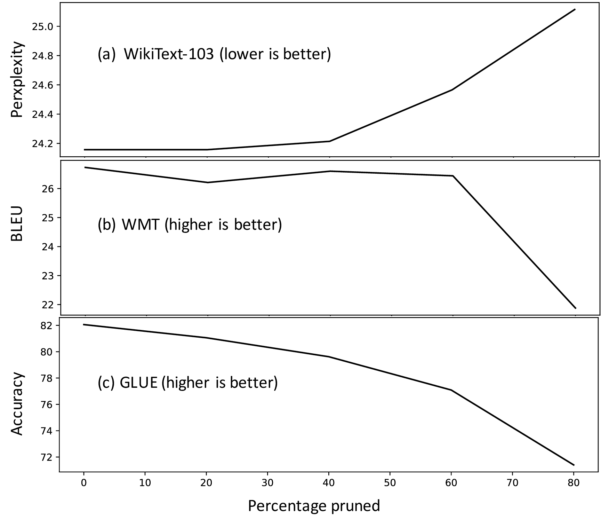

# Attention Pruning

This repo hosts code for [Data-Informed Global Sparseness in Attention Mechanisms for Deep Neural Networks](https://arxiv.org/abs/2012.02030) and borrows starter code from [fairseq](https://github.com/pytorch/fairseq), [huggingface](https://github.com/huggingface/transformers), and [transformer-xl](https://github.com/kimiyoung/transformer-xl).


## Results


### Performance
</img>

See paper for details, comparison with entmax, and ood results.

### Computational Efficiency
results on the SQuAD question answering task:


| Percentage  | Exact/F1 scores | Time(s) | GPU Memory(GB) |
| ----------- | --------------- | ------- | ---------------|
| 0           | 81.02/88.63     | 95.41   |6.85            |
| 90          | 79.62/87.32     | 86.44   |5.00            |


## Transformer-XL

We only experiment with pruning wikitext-103 base architecture. 

### Gathering average attention patterns

We add a ```compute_mask.py``` script to gather average attention patterns. To replicate our results you might need to modify some or all of:
<ul>
<li>the constants defined in the first few lines of compute_mask.py </li>
<li>last line of compute_mask which specifies where to save the average attention pattern.</li>
</ul>	


### Training sparse models

```train.py``` takes two additional arguments:

<ul>
<li>fn - specify path to average attention pattern </li>
<li>th - to specify desired sparseness percentage </li>
</ul>


## Fairseq

### Gathering average attention patterns

We add a ```compute_attn_score.py``` script to gather average attention patterns which saves the average attention patterns as numpy arrays in ```avg_attn_probabilities``` folder. Additionally, it takes a few parameters: 

<ul>
<li> path - path to directory with checkpoint for trained model  </li>
<li> fn - filename of said checkpoint  </li>
<li> cuda - true by default, set flag if you want to use cpu  </li>
<li> attn_type - one of 'self-enc', 'self-dec' or 'enc-dec' to specify what type of average pattern we want to compute  </li>
<li> dataset_name  </li>
<li> half - whether the checkpoint used half-precision training or not  </li>
<li> use_entmax - whether the checkpoint used entmax or not (default is softmax)  </li>
<li> using_old_model - whether we're using a pre-trained fairseq model  </li>
</ul>

### Training sparse models

```train.py``` takes some additional arguments:

<ul>
<li>PRUNE_BOOL, PRUNE_ENC_SELF_ATTN, PRUNE_DEC_SELF_ATTN, PRUNE_ENC_DEC_ATTN - flags to specify if we want to use sparse attention, and if so, what type(s) </li>
<li>TAU - desired sparseness percentage </li>
<li>USE_ENTMAX - flag to specify if we want to use entmax or not (default is softmax) </li>
<li>ENCODER_SELF_ATTN_PATH, DECODER_SELF_ATTN_PATH, ENCODER_DECODER_ATTN_PATH - path(s) to average attention pattern(s) if necessarily  </li>
<li>CUDA - flag to use CUDA training  </li>
<li>RANDOM_PRUNE - flag for random pruning experiments  </li>
</ul>

## Transformers - BERT

First of all, make sure to run this in an environment where the transformers library is not installed. 

Run ```src/run_glue.py``` to either collect attention patterns or train sparse models. We added four additionl arguments: 

<ul>
<li>save_attention_patterns - flag to Save Attention Pattern To Disk</li>
<li>prune - flag to use sparse attention mechanisms</li>
<li>attn_path - path to attention patterns when either using sparse attention mechanisms or saving these patterns to disk</li>
<li>tau - prune percentage </li>
</ul>
